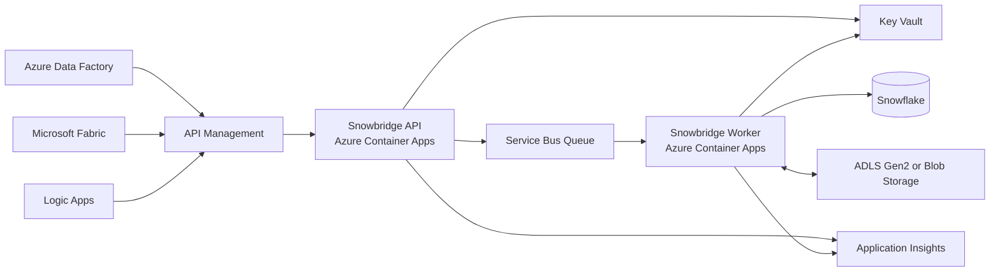

# Snowbridge

> **Work in progress:** Snowbridge is an early MVP under active development.
> The mock backend is suitable for local API testing, but the planned Azure
> architecture and real Snowflake integration are not yet production-ready.

Snowbridge is a Python HTTP service that gives Azure Data Factory, Microsoft
Fabric, Logic Apps, and other orchestrators one stable interface for controlled
Snowflake operations.

Its governed AI planner uses Microsoft Foundry to translate natural-language
requests into structured, allowlisted operations. Snowbridge validates the plan
and requires explicit confirmation before execution; model-generated SQL is
never accepted or run.

The first version runs against an in-process mock Snowflake adapter. The same API
can later use the official Snowflake Python Connector by changing configuration.

## Use Case

Use native Azure Snowflake connectors for straightforward data copy operations.
Use Snowbridge when several Azure workloads need a shared, governed integration
layer for Snowflake operations, including:

- Consistent authentication, validation, authorization, and auditing.
- Allowlisted query templates or stored procedures instead of unrestricted SQL.
- Idempotent, asynchronous jobs for long-running loads and exports.
- Shared business rules and response contracts across Data Factory, Fabric, and
	Logic Apps.
- Controlled movement of large datasets through ADLS Gen2 or Blob Storage.

## Planned Architecture



The current container combines the HTTP API and synchronous in-memory job
execution for local development. The planned Azure deployment separates the API
from a background worker, queues long-running work through Service Bus, stores
secrets in Key Vault, and sends telemetry to Application Insights. HTTP requests
carry control information; large files move through Azure Storage rather than
through API responses.

The public REST contract is intended to remain stable as the mock adapter is
replaced by a real Snowflake connection and the in-memory job runner is replaced
by persistent, asynchronous processing.

## Current API

- `GET /health`: application health and selected backend.
- `GET /v1/snowflake/health`: adapter connectivity check.
- `POST /v1/jobs`: execute an approved operation.
- `GET /v1/jobs/{job_id}`: retrieve an in-memory job result.
- `GET /v1/ai/operations`: list operations available to the AI planner.
- `POST /v1/ai/plan`: translate natural language into a structured operation plan.
- `POST /v1/ai/execute`: execute a validated plan after explicit confirmation.
- `GET /docs`: interactive OpenAPI documentation.

The MVP supports three allowlisted operations:

- `echo`: verifies parameter binding and result serialization.
- `current_context`: returns account, user, role, and warehouse context.
- `warehouse_usage_summary`: summarizes credits and metered hours for the last 1-90 days.

Jobs execute synchronously in this first slice but use a job-shaped contract so
queue-backed asynchronous execution can be added without changing callers.

## Local Development

Prerequisites: Python 3.11 through 3.14 and [uv](https://docs.astral.sh/uv/).

```powershell
Copy-Item .env.example .env
uv sync --extra dev
uv run uvicorn snowbridge.main:app --reload
```

Open <http://127.0.0.1:8000/docs> to exercise the API.

Submit a mock operation:

```powershell
$body = @{
	operation = "echo"
	parameters = @{ message = "hello from Azure" }
	idempotency_key = "demo-001"
} | ConvertTo-Json

Invoke-RestMethod `
	-Method Post `
	-Uri http://127.0.0.1:8000/v1/jobs `
	-ContentType application/json `
	-Body $body
```

Run checks:

```powershell
uv run --extra dev pytest
uv run --extra dev ruff check .
```

## AI Planner

The default `mock` AI backend provides deterministic local demos without cloud
credentials. Submit a natural-language request:

```powershell
$plan = Invoke-RestMethod `
	-Method Post `
	-Uri http://127.0.0.1:8000/v1/ai/plan `
	-ContentType application/json `
	-Body (@{ request = "Show warehouse usage for the last 14 days" } | ConvertTo-Json)

$execution = @{
	plan = $plan
	confirmed = $true
	idempotency_key = "ai-demo-14-days"
} | ConvertTo-Json -Depth 5

Invoke-RestMethod `
	-Method Post `
	-Uri http://127.0.0.1:8000/v1/ai/execute `
	-ContentType application/json `
	-Body $execution
```

To use Microsoft Foundry, install the AI dependencies and configure the model
endpoint shown in `.env.example`:

```powershell
uv sync --extra dev --extra ai
```

Set `SNOWBRIDGE_AI_BACKEND=foundry`. When no API key is configured, Snowbridge
uses `DefaultAzureCredential`, which supports Azure CLI credentials locally and
managed identity in Azure.

## Docker

```powershell
docker build -t snowbridge:local .
docker run --rm -p 8000:8000 snowbridge:local
```

On networks that require an approved Python package mirror, pass it at build
time:

```powershell
docker build `
	--build-arg PIP_INDEX_URL=https://your-package-mirror.example/simple/ `
	-t snowbridge:local .
```

The container runs in mock mode by default and does not require Snowflake
credentials.

Build an image containing the optional Snowflake connector when real-account
testing begins:

```powershell
docker build `
	--build-arg 'SNOWBRIDGE_EXTRAS=[snowflake]' `
	-t snowbridge:snowflake .
```

## Switching to a Snowflake Trial Account

Install the optional connector dependency:

```powershell
uv sync --extra dev --extra snowflake
```

Set the backend and connection settings shown in `.env.example`:

```dotenv
SNOWBRIDGE_SNOWFLAKE_BACKEND=snowflake
SNOWBRIDGE_SNOWFLAKE_ACCOUNT=organization-account
SNOWBRIDGE_SNOWFLAKE_USER=SNOWBRIDGE_USER
SNOWBRIDGE_SNOWFLAKE_PRIVATE_KEY_PATH=C:\path\to\snowflake_key.p8
SNOWBRIDGE_SNOWFLAKE_WAREHOUSE=SNOWBRIDGE_WH
SNOWBRIDGE_SNOWFLAKE_DATABASE=SNOWBRIDGE_DB
SNOWBRIDGE_SNOWFLAKE_SCHEMA=PUBLIC
SNOWBRIDGE_SNOWFLAKE_ROLE=SNOWBRIDGE_ROLE
```

Prefer key-pair authentication and a dedicated least-privilege Snowflake role.
Do not commit `.env` or private keys. In Azure, retrieve secrets from Key Vault
using managed identity or mount them as Container Apps secrets.

The public endpoints and request/response formats remain unchanged when the
backend changes.

## Project Structure

```text
src/snowbridge/
|-- config.py
|-- jobs.py
|-- main.py
|-- models.py
`-- snowflake/
	|-- client.py
	|-- factory.py
	|-- mock_client.py
	`-- real_client.py
```

The API depends on the `SnowflakeClient` protocol. Both adapters normalize their
results into the same application models, which keeps Azure callers independent
of Snowflake connector details.